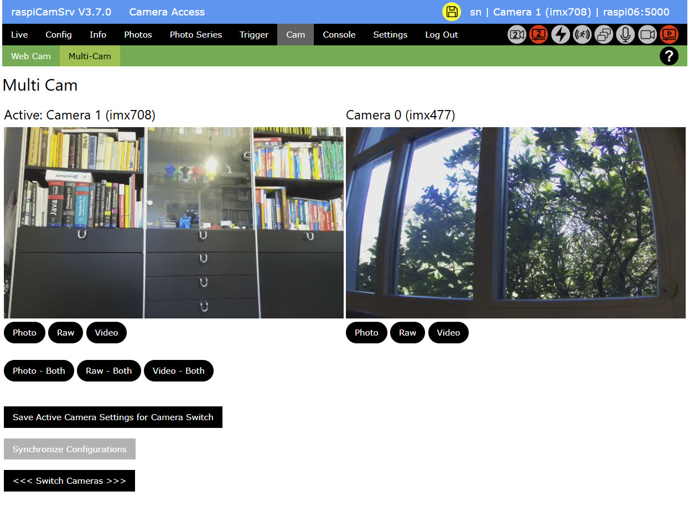

# Multi-Camera Control

**NOTE**: This dialog is only available for systems with two non-USB cameras connected (currently only Pi 5).

While live streams for both cameras are shown, this dialog allows photo taking and video recording either individually with each of the two cameras or simultaneously with both.

The left side of the page always shows the active camera.

When switching the cameras, either with the **Switch Cameras** button on this side or by changing the camera in the [Settings](./Settings.md#switching-the-active-camera), the streams will be exchanged.

### Buttons

#### Photo / Raw / Video

Every camera has an own set of action buttons which apply only to this camera.   
Their function is identical to that of the corresponding [buttons on the Live screen](./Phototaking.md)

The resulting photos or place holders will not be shown on this page.    
They are stored in camera-specific subfolders and are accessible through the [Photos](./PhotoViewer.md) dialog

For the active camera, the last photo or placeholder is shown in the [Photo Display of the Live screen](./Phototaking.md#photo-display) and can be added to the display buffer for inspection of meta data or histogram..

#### Photo - Both / Raw - Both / Video - Both

When these buttons are pressed, the respective function is applied for both cameras.

The media files will have the same name for both cameras, which is generated from the timestamp of command execution, but are stored in their camera-specific subfolder.    
This allows identifying photos which have been synchronously taken and videos which have been synchronously started.

**NOTE**: Currently, the actions on both cameras are executed sequentially, so that there may be a small subsecond delay.

#### Save Active Camera Settings for Camera Switch

This button stores the current [Camera Configuration](./Configuration.md) for all configurations as well as the current [Controls](./CameraControls.md) settings for the active camera in a specific structure (streamingCfg) so that it can be reused for streaming in a case that the other camera has been activated. (See also [Configuring MJPEG Stream and jpeg Photo](#configuring-mjpeg-stream-and-jpeg-photo))

#### Synchronize Configurations

This button is disabled if the two cameras are of different model.

If they are the same model, the button can be used to transfer the configuration as well as the controls settings from the active camera to the second camera. This is especially useful in the case of [Stereo Vision](./CamStereo.md) where both cameras should be operated with identical configuration.

**NOTE**: the button does **not** save the settings for the active camera in the *streamingCfg* structure. This must be done explicitly and is recommended to be done before synchronizing.

#### <<< Switch Cameras >>>

With this button, you can switch the cameras so that the one sown on the right side will become the active camera.

## Process Status Indicators

[Process Status Indicators](./UserGuide.md#process-status-indicators) show whether a camera is currently recording video or not.   
This is done independently for the active camera   and for the other camera .

**NOTE** that the recording status indicators are also activated when recording is started through the [API](./API.md)

## Configuring MJPEG Stream and jpeg Photo

With **raspiCamSrv**, [Camera Configuration](./Configuration.md) and [Controls](./CameraControls.md) apply always to the active camera (which camera is the active one, can be selected in the [Settings](./Settings.md)).

When the Flask server starts up without preloading stored configurations, the active camera and, if available, the second camera are preconfigured with parameter defaults.

The entire [Camera Configuration](./Configuration.md) as well as the [Controls](./CameraControls.md) for both cameras are stored in a specific streaming datastructure.

When [Camera Configuration](./Configuration.md) and/or [Controls](./CameraControls.md) for the active camera are modified, these settings will **not** be automatically stored in the streaming configuration.    
This must be actively done with the **Save Active Camera Settings for Camera Switch**.

When cameras are switched, configuration and controls for the active camera will be replaced by those from the second camera stored in the streaming datastructure.

In order to configure your camera setup, you can proceed as follows:

1. Select one of the cameras as active camera
2. Adjust the [Camera Configuration](./Configuration.md),    
for example *Transform* and/or *Sensor Mode* with *Stream Size*
3. Adjust the [Controls](./CameraControls.md),    
for example *focus*/*lensposition*, *zoom*, *AutoExposure* or others
4. When the setup is satisfactory, go to the *Multi-Cam* dialog and press the **Save Active Camera Settings for Camera Switch** button.
5. Then switch cameras with the **<<< Switch Cameras >>>** button.
6. Repeat steps 2. to 4. for the other camera
7. If you now switch cameras, each stream, photo, raw photo and video should show in the way specifically configured for the camera.
8. Now you can go to the [Settings](./Settings.md) screen and push the **Store Configuration** button in order to persist the streaming data along with the other configuration settings.
9. If you want the entire configuration, including the streaming configuration, to be loaded when the server starts up, check the related checkbox in the [Settings](./Settings.md) screen.

