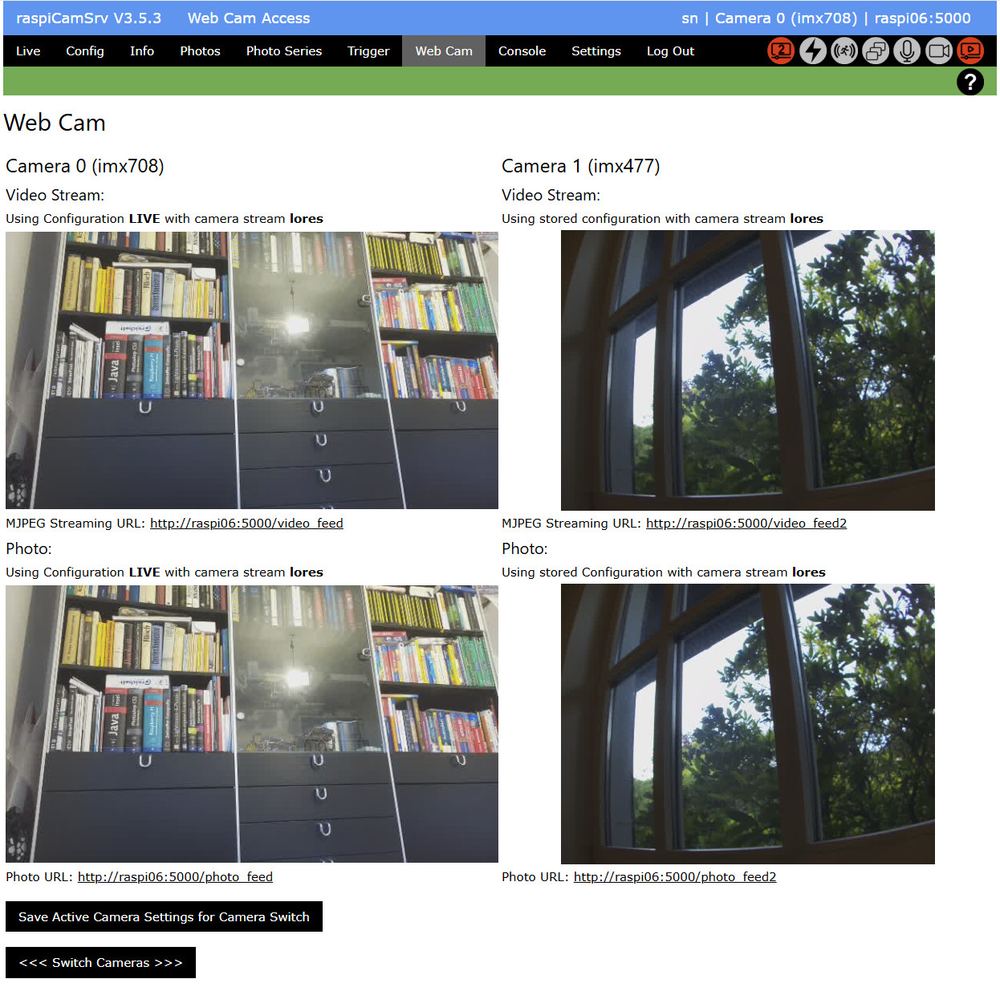

# Web Cam Settings

**raspiCamSrv** enables webcam functionalities with Raspberry Pi cameras.

For Pi 5 with two camera ports, both cameras can be streamed simultaneously.

This page shows the URLS for MJPEG streaming as well as for photo snapshots:

The left side of the page always shows the active camera.   
If an additional camera is available, video stream and photo are shown on the right side.

When switching the cameras, either with the **Switch Cameras** button on this side or by changing the camera in the [Settings](./Settings.md#switching-the-active-camera), the streams will be exchanged.   
The *video_feed* endpoint will always refer to the active camera, which is also shown in the title bar.    
The *video_feed2* endpoint will always refer to the other camera, if available.

The configuration and camera stream used for video and photo capture are indicated.

The links shown on the page open a new browser window.

### Buttons

#### Save Active Camera Settings for Camera Switch

This button stores the current [Camera Configuration](./Configuration.md) for *Live View* and *Video* as well as the current [Controls](./CameraControls.md) settings for the active camera in a specific structure (streamingCfg) so that it can be reused for streaming in a case that the other camera has been activated. (See also [Configuring MJPEG Stream and jpeg Photo](#configuring-mjpeg-stream-and-jpeg-photo))

#### <<< Switch Cameras >>>

With this button, you can switch the cameras so that the one sown on the right side will become the active camera.

## Process Status Indicators

[Process Status Indicators](./UserGuide.md#process-status-indicators) show whether a background thread for streaming is active or not.   
This is independently done for the active camera   and for the other camera 

## Video Stream

The video stream will always use the LIVE configuration.   
By default, this configuration uses the *lores* camera stream.   
The camera stream as well as its *stream size* can be configured in the [Configuration](./Configuration.md) screen.

## Photo Snapshot

The photo snapshot is currently also using the LIVE configuration.

## Configuring MJPEG Stream and jpeg Photo

With **raspiCamSrv**, [Camera Configuration](./Configuration.md) and [Controls](./CameraControls.md) apply always to the active camera (which camera is the active one, can be selected in the [Settings](./Settings.md)).

When the Flask server starts up without preloading stored configurations, the active camera and, if available, the second camera are preconfigured with parameter defaults.

The Live View Configuration as well as the Controls for both cameras are stored in a specific streaming datastructure.

When [Camera Configuration](./Configuration.md) and/or [Controls](./CameraControls.md) for the active camera are modified, these settings can be saved with the **Save Active Camera Settings for Camera Switch**.   
When cameras are switched, their specific configurations and controls will be applied.

In order to configure your camera setup, you can proceed as follows:

1. Select one of the cameras as active camera
2. Adjust the [Camera Configuration](./Configuration.md),    
for example *Transform* and/or *Sensor Mode* with *Stream Size*
3. Adjust the [Controls](./CameraControls.md),    
for example *focus*/*lensposition*, *zoom*, *AutoExposure* or others
4. When the setup is satisfactory, go to the *Webcam* dialog and press the **Save Active Camera Settings for Camera Switch** button.
5. Then switch cameras with the **<<< Switch Cameras >>>** button.
6. Repeat steps 2. to 4. for the other camera
7. If you now switch cameras, each stream and photo should show in the way specifically configured for the camera.
8. Now you can go to the [Settings](./Settings.md) screen and push the **Store Configuration** button
9. If you want the entire configuration, including the streaming configuration, to be loaded when the server starts up, check the related checkbox in the [Settings](./Settings.md) screen.

